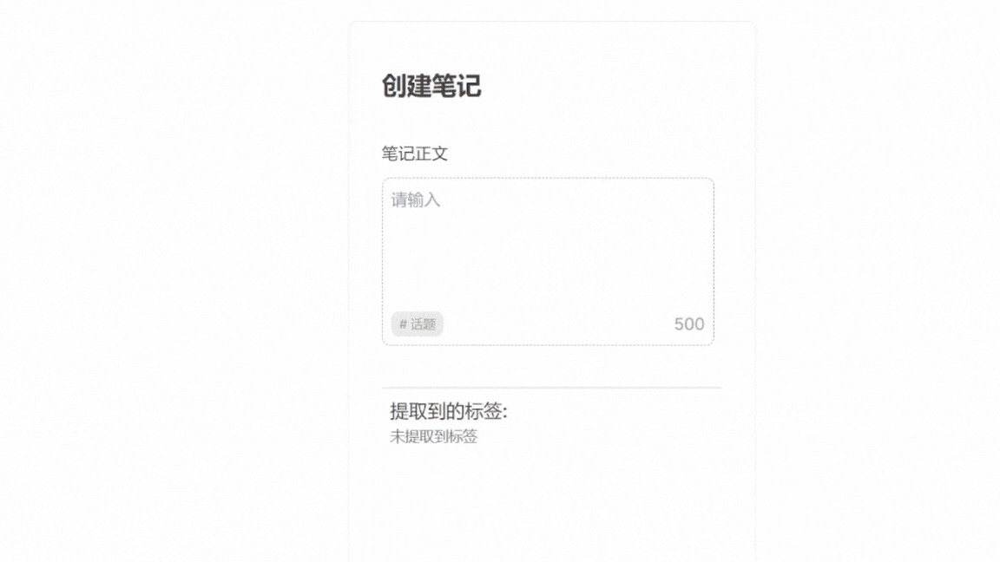

# 💡App Features
- Highlight hashtags dynamically as you type '#'.
- Search for relevant hashtags to match your input.
- Extract hashtags seamlessly from the text input field.

## 🚀 Getting Started 🚀
Make sure you have Node.js 16.8.0 or later installed in your environment.

1. Install Dependencies `npm install`
2. Run the app `npm run dev`
3. Open [http://localhost:3000](http://localhost:3000) with your browser to see the result.

Try your own datasets by modifying `dataset/hashtagMockdata.ts`

## ⭐ Demo ⭐

